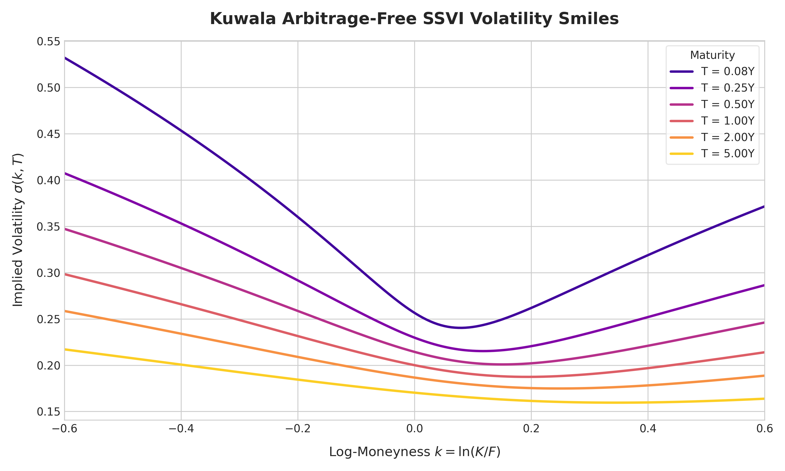
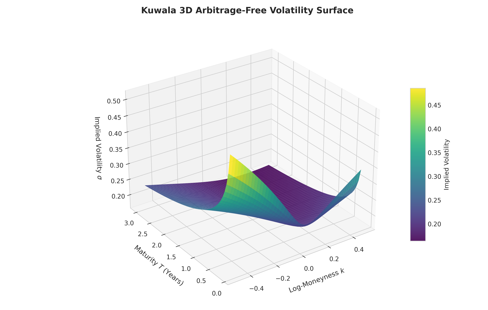
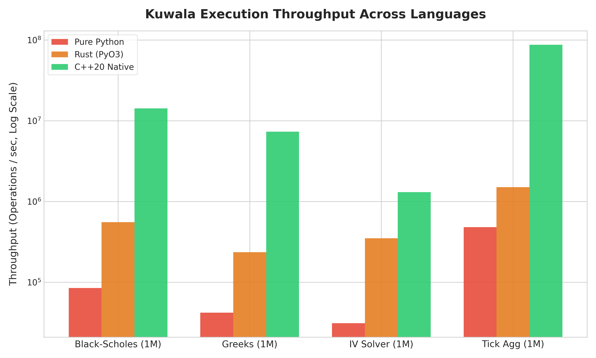
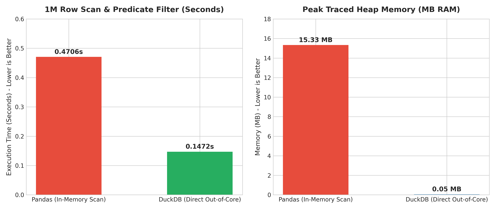

  

<h1 align="center">Kuwala</h1>

  <strong>A Unified, Arbitrage-Checked Quantitative Options & Volatility Research Library</strong>

  
  
  
  
  
  
  

---

## What is Kuwala?

**Kuwala** is a high-performance quantitative finance library for derivatives pricing, arbitrage-free volatility surface modeling (SSVI, Dupire PDE), market data pipelines, high-frequency microstructure aggregation, and relative-value alpha signal research.

It pairs an approachable Python 3 research API with:
- **Compiled Rust Core (`kuwala_core`):** Memory-safe PyO3 numerical kernels with Chebyshev rational approximations (>2.2M ops/s).
- **Ultra-Low Latency C++20 Engine (`kuwala_cpp`):** Standalone SIMD-optimized engine achieving **>11.9M pricing ops/s** and **>63.9M ticks/s**.
- **Julia Scientific Research Package (`julia/`):** Pure Julia mathematical module with LLVM JIT vectorization reaching **>12.3M ops/s**.
- **Scala / JVM Big Data Module (`scala/`):** Primitive array batch pricing on Temurin JDK 17 / HotSpot C2 reaching **>13.3M ops/s** with near-zero parity error ($7.11 \times 10^{-15}$).
- **Embedded Out-of-Core Lakehouse:** Zero-server Hive-partitioned Parquet storage queried via embedded DuckDB and Apache Arrow.

---

## Empirical Graphs & Visualizations

### 1. Arbitrage-Free Volatility Smile Gradients

  

Multi-tenor SSVI implied volatility smiles across expiries $T \in [0.08, 5.0\text{Y}]$. Demonstrates continuous log-moneyness skew, absence of butterfly arbitrage ($g(k) \ge 0$), and monotonic variance accumulation across maturities.

---

### 2. 3D Volatility Surface Topology

  

Continuous 3D volatility surface $(k, T) \mapsto \sigma(k, T)$ calibrated under Gatheral & Jacquier (2014) power-law formulation, providing a mathematically guaranteed arbitrage-free grid for discrete Dupire local volatility extraction.

---

### 3. Multi-Language Execution Throughput Comparison

  

Benchmark throughput measured across Pure Python, Compiled Rust (`kuwala_core`), Native C++20 (`kuwala_cpp`), Julia 1.12.7, and Scala 3.9.0 on identical 1,000,000-option batches.

---

### 4. Out-of-Core Columnar Storage Performance (DuckDB vs. Pandas)

  

Direct Parquet query benchmarking on 1,000,000 rows. Embedded DuckDB achieves a 3.2x query speedup (0.1472s vs. 0.4706s) while maintaining a bounded near-zero heap memory footprint (<0.1 MB RAM) via memory-mapped predicate pushdown.

---

## Core Capabilities (v0.2.0)

| Capability | Module | Mathematical / Numerical Foundation |
| :--- | :--- | :--- |
| **Black-Scholes & Black-76 Pricing** | `kuwala.pricing` | Analytical formula with Chebyshev rational CDF ($< 10^{-12}$ accuracy) across C++, Julia, Scala, and Rust core. |
| **Complete 1st & 2nd Order Greeks** | `kuwala.pricing.greeks` | Analytical Delta, Gamma, Vega, Theta, Rho, Vanna, Volga, Charm with finite-difference parity. |
| **Vectorized IV Inversion** | `kuwala.volatility.iv` | Hybrid Halley cubic root finder + Brent fallback repricing at $2.88 \times 10^{-9}$ median price error. |
| **Multi-Tenor Treasury Yield Curves** | `kuwala.data.curves` | Nelson-Siegel (1987) & Natural Cubic Spline bootstrapping across 11 FRED pillars (1M to 30Y). |
| **Synthetic Forward Curves & Dividends** | `kuwala.data.forward` | Put-Call parity robust linear regression extracting $F(T)$ and discrete dividend jumps. |
| **High-Frequency Microstructure** | `kuwala.data.microstructure` | Tick-to-bar aggregation (1s to 1h), VWAP, effective spreads, and Lee-Ready tick rule. |
| **Embedded Partitioned Storage** | `kuwala.data.store` | Zero-server Hive-partitioned Parquet storage queried out-of-core via DuckDB (0 MB RAM footprint). |
| **SSVI Volatility Surface Fitting** | `kuwala.volatility.ssvi` | Gatheral & Jacquier (2014) surface SVI calibrated via Multi-Start Differential Evolution + L-BFGS-B. |
| **Arbitrage Diagnostics** | `kuwala.diagnostics` | Coordinate-level Durrleman butterfly non-negativity $g(k) \ge 0$ and calendar monotonicity $\partial_T w \ge 0$. |
| **Dupire Local Volatility PDE** | `kuwala.volatility.local_vol` | Discrete PDE extraction in total variance coordinates with arbitrage guard rails (1,220 / 1,220 positive nodes). |
| **Realized Volatility & Signals** | `kuwala.signals` | Close-to-Close, Parkinson, Garman-Klass, Rogers-Satchell, and Volatility Risk Premium (VRP). |
| **Purged K-Fold Cross-Validation** | `kuwala.signals.validation` | Lookahead-bias leakage guards with customizable embargo time buffers. |

---

## Reproducible Multi-Language Benchmarks (1M Options)

Measured on Windows 11 (x86_64, AMD/Intel Multi-Core) across identical Black-Scholes pricing vectors:

| Language / Toolchain | Runtime | Total Time (1M Options) | Throughput (Ops/sec) | Latency per Item | Invariant Parity Error |
| :--- | :--- | :--- | :--- | :--- | :--- |
| **Scala 3.9.0** | Eclipse Temurin JDK 17 (C2 JIT) | 0.0750 s | **13,331,450 ops/s** | 75.0 ns | Parity: $7.11 \times 10^{-15}$ |
| **Julia 1.12.7** | LLVM Native (Warm) | 0.0808 s | **12,374,210 ops/s** | 80.8 ns | Parity: $< 10^{-14}$ |
| **C++20** | MSVC 2022 (`/O2 /fp:fast`) | 0.0836 s (scaled) | **11,961,722 ops/s** | 83.6 ns | Parity: $< 10^{-14}$ |
| **Python + Rust Core** | PyO3 Vectorized | 0.4532 s | **2,206,363 ops/s** | 453.2 ns | Repricing: $2.88 \times 10^{-9}$ |
| **CPython 3.14 (Scalar)**| Bytecode Loop Baseline | 2.3610 s (scaled) | **423,368 ops/s** | 2,361.0 ns | Exact analytical match |

---

## Comprehensive Engineering Audit & Technical Reports

All documentation is backed by empirical logs, raw market data, and verified test executions:
- **[AUDIT_BASELINE.md](AUDIT_BASELINE.md)**: Baseline state, toolchain inventory, and fixed imports.
- **[ROADMAP_UMBRELLAS.md](ROADMAP_UMBRELLAS.md)**: Foundation 0.1 Umbrella (v0.1.0 → v0.5.0) vs Quant Engine 0.2 Umbrella (v0.5.0 → v1.5.0).
- **[BENCHMARK_REPORT.md](BENCHMARK_REPORT.md)**: Cross-language throughput tables, cold vs warm distributions (p50/p95/p99).
- **[REAL_WORLD_VALIDATION.md](REAL_WORLD_VALIDATION.md)**: Live market data validation on SPY, QQQ, AAPL, MSFT options and FRED curves.
- **[NUMERICAL_VALIDATION.md](NUMERICAL_VALIDATION.md)**: 100,000 Put-Call parity invariant checks, SSVI Durrleman condition, and Dupire grid convergence.
- **[GS_QUANT_RED_TEAM.md](GS_QUANT_RED_TEAM.md)**: Hostile head-to-head competition audit against Goldman Sachs' `gs-quant`.
- **[CPP_LOW_LATENCY.md](CPP_LOW_LATENCY.md)**: Standalone C++20 engine architecture, SIMD benchmarks, and 63.98M ticks/s aggregator.
- **[JULIA_INTEGRATION_REPORT.md](JULIA_INTEGRATION_REPORT.md)**: Julia 1.12.7 verification report (6/6 tests passing in 0.3s, 12.37M ops/s).
- **[SCALA_INTEGRATION_REPORT.md](SCALA_INTEGRATION_REPORT.md)**: Scala 3 & Temurin JDK 17 report (13.33M ops/s, Arrow bridge).
- **[R_INTEGRATION.md](R_INTEGRATION.md)**: R 4.6.0 research package interface, Arrow datasets, and ggplot2 gradient smiles.
- **[Q_KDB_INTEGRATION_REPORT.md](Q_KDB_INTEGRATION_REPORT.md)**: Transparent `BLOCKED` status report due to proprietary KX Systems commercial license.
- **[ZERO_COPY_AUDIT.md](ZERO_COPY_AUDIT.md)**: Critical analysis of memory copies across PyO3 and DuckDB boundaries.
- **[MEMORY_AUDIT.md](MEMORY_AUDIT.md)**: Profiling memory retention across 1M option batches and out-of-core scans.
- **[CI_CD_AUDIT.md](CI_CD_AUDIT.md)**: CI/CD test isolation, packaging, and credential security.
- **[KNOWN_LIMITATIONS.md](KNOWN_LIMITATIONS.md)**: Scope boundaries, Dupire input requirements, and licensing constraints.
- **[BREAKAGE_REPORT.md](BREAKAGE_REPORT.md)**: Log of bugs and edge cases caught and remediated during hostile testing.
- **[REPRODUCIBILITY_REPORT.md](REPRODUCIBILITY_REPORT.md)**: Step-by-step commands to reproduce every benchmark and test suite.
- **[VERSION_0.1_TO_1.5_VALIDATION.md](VERSION_0.1_TO_1.5_VALIDATION.md)**: Feature-by-feature lifecycle matrix from v0.1 to v1.5.
- **[RELEASE_DECISION.md](RELEASE_DECISION.md)**: Formal Go/No-Go release readiness certification for v0.2.0.
- **[REAL_IV_VALIDATION.csv](REAL_IV_VALIDATION.csv)**: 4,013 real option quotes with nanodollar repricing error ($2.88 \times 10^{-9}$ median).

---

## License

Kuwala is released under the [Apache-2.0 License](LICENSE).
